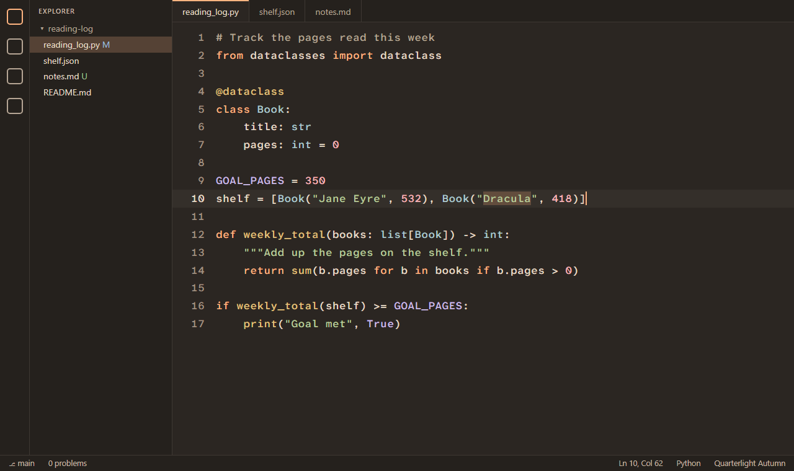
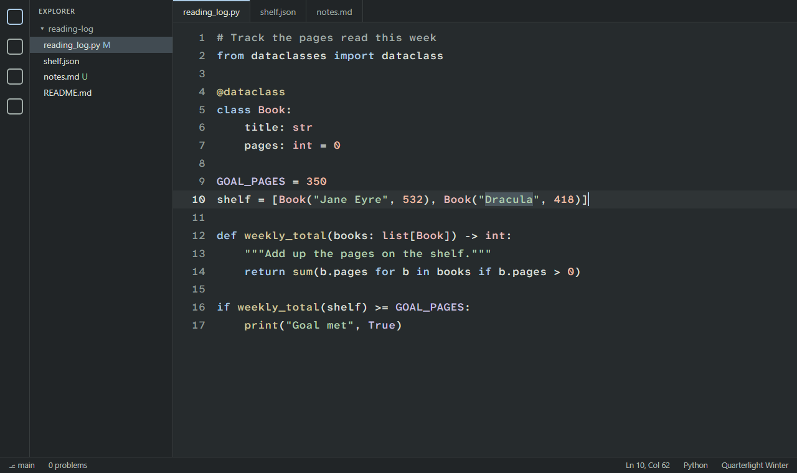
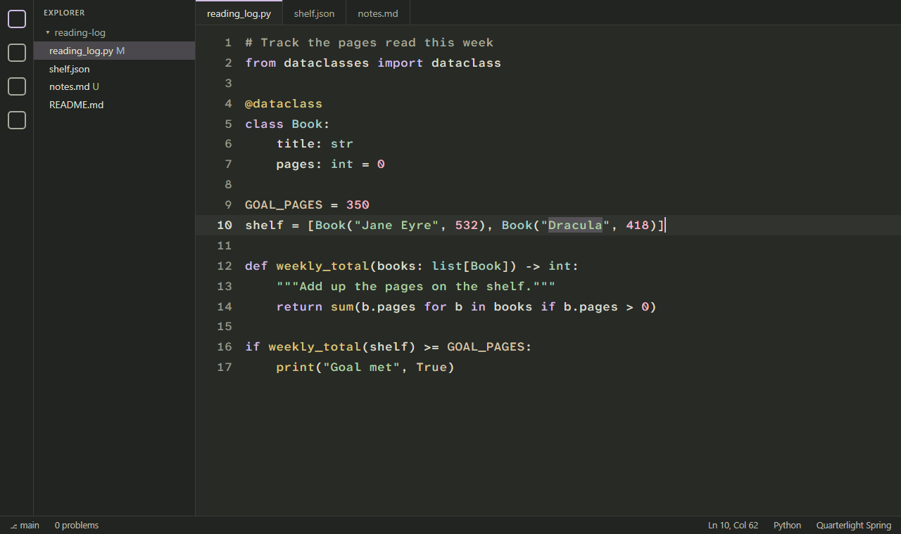
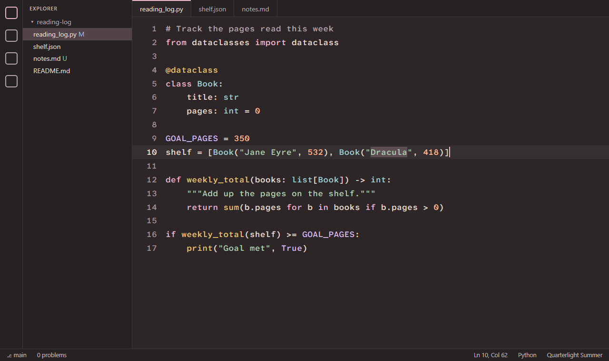

# Quarterlight

Four calm, low-glare dark themes that change with the seasons. Quarterlight is designed for long working days, astigmatism and tired eyes.



## Install

Search **Quarterlight** in VS Code's Extensions view. If it isn't listed yet, download the `.vsix` file from the [Releases page](https://github.com/FrizzieLizzie/quarterlight/releases/latest). Then in the Extensions view, open the **...** menu and choose **Install from VSIX...**.

## What makes it easier on the eyes

- **A dim background, never black.** Bright text on pure black makes letters glow and blur for people with astigmatism, an effect called halation. Quarterlight's warm charcoal backgrounds sit around 15% lightness.
- **Measured contrast.** Main text is about 11:1 (APCA Lc 82). That's above the comfortable-reading minimum and well below the 21:1 of white on black. Every code color has the same brightness (about 8.5:1, Lc 68), so no single color pulls your eye across the screen. Comments are softer but still readable (about 6:1, Lc 52).
- **Muted colors.** Bright saturated reds and blues side by side can make edges appear to shimmer. All the colors here are softened.
- **No italics** in code, because slanted letters are harder to read with low vision.

## The four seasons

| Season | Starts | Feel |
|---|---|---|
| Autumn | Sep 22 | Marigold, brass and candlelight on walnut |
| Winter | Dec 21 | Black pine, frost and holly |
| Spring | Mar 20 | Violets, daffodils and new moss |
| Summer | Jun 21 | Midsummer dusk: honey, sea glass and wild berries |

When a Quarterlight theme is in use, it switches to the current season on its own. If you pick a different season by hand, automatic switching pauses until you run **Quarterlight: Use the Current Season's Theme**. You can change the start dates, or flip the seasons for the southern hemisphere, in Settings.

### Screenshots

| Winter | Spring |
|---|---|
|  |  |

| Summer | Autumn |
|---|---|
|  |  |

## Eye-comfort settings (optional)

Run **Quarterlight: Apply Eye-Comfort Settings** from the Command Palette (`Ctrl+Shift+P`, or `Cmd+Shift+P` on a Mac). It:

- uses Atkinson Hyperlegible Mono, a free font from the Braille Institute designed for low vision, at 17px with extra line spacing
- turns off cursor blinking, smooth scrolling and other animations
- hides the minimap and softens highlights

**Quarterlight: Restore My Previous Settings** puts everything back the way it was.

The font is free from Google Fonts. **Quarterlight: Get the Atkinson Hyperlegible Mono Font** opens its download page. Install it once on each computer, then close and reopen VS Code. Until then, VS Code uses a similar built-in font.

## 20-20-20 break reminder

Every 20 minutes while VS Code is open, a small notification reminds you to look at something about 20 feet (6 m) away for 20 seconds. Time spent in other apps counts too, because it's still screen time. If the reminder comes due while you're in another app, it appears when you return to VS Code. This is the break the American Academy of Ophthalmology recommends for digital eye strain. Click **Start 20-Second Timer** for a countdown in the status bar. If VS Code is closed or your computer sleeps for five minutes, that counts as a break. With several windows open, you still get only one reminder.

In Settings, under `quarterlight.breakReminder`, you can change the interval, switch to a quiet status-bar-only reminder, or turn it off.

## A note on eye health

A theme can make the screen more comfortable, but it doesn't replace an eye exam. If your eyes lose focus or seem to jump on their own, talk to an optometrist or ophthalmologist.

## Building from source

The palettes live in `scripts/palettes.json`. After editing them:

```
python scripts/build_themes.py        # writes themes/, refuses if any color misses its contrast target
python scripts/build_screenshots.py   # optional: refreshes images/ (needs Microsoft Edge)
node --test scripts/test_seasons.js scripts/test_breaks.js   # checks season dates and break timing
npx @vscode/vsce package              # builds the .vsix installer
```

## License

The themes and extension code are MIT-licensed. Atkinson Hyperlegible Mono is © the Braille Institute of America, under the SIL Open Font License 1.1. A copy is kept in this repository's `fonts/` folder for the screenshot script; it isn't part of the extension package.
